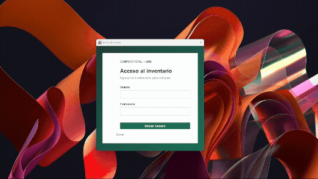

# Inventario de equipos informáticos

Aplicación para el inventario de equipos de COMPUTO TOTAL GMD S. A. Usa Java 17, servicios de negocio y almacenamiento en memoria. Los datos se reinician al cerrar la aplicación.

## Requisitos

- JDK 17 o superior.
- Maven 3.9 o superior.
- PowerShell abierto en la raiz del proyecto.

## Iniciar

La aplicación abre una ventana gráfica para iniciar sesión y luego muestra el panel de inventario. Las opciones disponibles dependen del rol. Al seleccionar un módulo, la ventana anterior se cierra y se abre la del módulo elegido; el panel principal permite volver a navegar.

```powershell
mvn clean compile
java -cp target/classes com.computototal.inventario.Main
```

Usa una de estas cuentas de demostración en la ventana de acceso:

| Rol | Usuario | Contraseña |
|---|---|---|
| Administrador | `admin` | `admin-demo-2026` |
| Almacenero | `almacen` | `almacen-demo-2026` |
| Auditor | `auditor` | `auditor-demo-2026` |

Los formularios permiten registrar y consultar equipos, gestionar movimientos, revisar stock y alertas, consultar historiales y generar reportes. El menú ofrece anular altas con un único ingreso inicial; la anulación conserva el historial y solicita un motivo. Los equipos anulados no aparecen en las listas operativas, pero su historial sigue disponible. El número de serie debe tener entre 3 y 40 caracteres, usar letras, números, guion, punto, guion bajo o barra, y empezar y terminar con letra o número; se normaliza a mayúsculas. Para reportes, ingresa fechas con formato `AAAA-MM-DD`. El boton para cerrar sesión finaliza la aplicación.

El Administrador y el Almacenero pueden registrar y operar inventario y configurar minimos. El Auditor puede consultar existencias, alertas, historial e informes. Las operaciones vuelven a comprobar permisos en los servicios.

## Manual de usuario

### 1. Iniciar sesion

1. Inicia la aplicacion con los comandos de la seccion [Iniciar](#iniciar).
2. Escribe el usuario y la contrasena de una de las cuentas disponibles.
3. Selecciona **Iniciar sesion**. El panel principal mostrara los modulos permitidos para ese rol.



### 2. Registrar un equipo

1. En la seccion **Equipos**, abre **Registrar equipo**.
2. Completa codigo, numero de serie, marca y modelo.
3. Selecciona categoria, proveedor y almacen inicial.
4. Escribe el motivo del ingreso y selecciona **Registrar equipo**.
5. El equipo queda registrado como disponible en el almacen seleccionado.

La serie debe tener entre 3 y 40 caracteres. Se permiten letras, numeros, guion (`-`), punto (`.`), guion bajo (`_`) y barra (`/`); debe iniciar y terminar con letra o numero. El sistema la normaliza a mayusculas.

**Captura pendiente:** formulario de registro y confirmacion del equipo.

### 3. Consultar o listar equipos

1. Abre **Consultar equipo** para buscar por codigo o numero de serie, o **Listar equipos** para ver el inventario activo.
2. Para una consulta, escribe el criterio elegido y ejecuta la busqueda.
3. Los equipos anulados no aparecen en las listas operativas. Puedes buscarlos por codigo o serie para revisar su historial.

**Captura pendiente:** consulta y listado de equipos.

### 4. Registrar movimientos

En los formularios de movimientos, selecciona el equipo de la lista; se muestran su codigo, serie, marca, modelo y estado. Completa los datos solicitados y el motivo.

- **Registrar ingreso:** selecciona el equipo, el almacen de destino y el motivo. Se usa para recibir o reingresar un equipo.
- **Registrar salida:** selecciona el equipo e indica destino externo y motivo. Solo puede salir un equipo disponible en almacen.
- **Trasladar entre sedes:** selecciona equipo y almacen de destino de otra sede; agrega el motivo.
- **Cambiar ubicacion:** selecciona equipo y nueva ubicacion dentro de su sede; agrega el motivo.
- **Cambiar estado tecnico:** selecciona equipo, estado y justificacion.

**Captura pendiente:** lista de seleccion de equipo y formularios de movimientos.

### 5. Revisar existencias y alertas

1. Abre **Existencias actuales** para consultar las cantidades disponibles por categoria y sede.
2. Para establecer un minimo, abre **Configurar stock minimo**, selecciona categoria y sede, ingresa un valor igual o mayor que cero y guarda.
3. Abre **Alertas de stock** para revisar las sedes cuya disponibilidad esta por debajo del minimo.

**Captura pendiente:** existencias actuales, configuracion de minimo y alertas.

### 6. Consultar historial y reportes

1. Abre **Historial de movimientos** y busca el equipo por codigo o serie.
2. Para generar un reporte, abre **Reportes por fechas**, selecciona alcance global o por sede e ingresa las fechas inicial y final con formato `AAAA-MM-DD`.
3. El reporte separa ingresos, salidas, anulaciones y traslados.

**Captura pendiente:** historial y reporte por fechas.

### 7. Anular un alta reciente

Esta opcion esta disponible para el Administrador. Solo se puede anular un equipo cuyo unico movimiento sea el ingreso inicial y que siga disponible en almacen.

1. Abre **Anular alta reciente**.
2. Selecciona el equipo de la lista e ingresa el motivo de anulacion.
3. Confirma la operacion. El sistema marca el equipo como anulado, lo excluye del inventario activo y conserva el historial.

**Captura pendiente:** formulario y confirmacion de anulacion.

### 8. Cerrar sesion

1. Selecciona la opcion para cerrar sesion.
2. Confirma el cierre. Para continuar, inicia sesion nuevamente.

**Captura pendiente:** confirmacion de cierre de sesion.

## Demostración automática

Ejecuta los mismos servicios con reloj y datos reproducibles, sin entrada interactiva:

```powershell
java -cp target/classes com.computototal.inventario.Main --demo
```

Las verificaciones aisladas se pueden repetir con:

```powershell
java -cp target/classes com.computototal.inventario.demo.VerificacionDao
java -cp target/classes com.computototal.inventario.demo.VerificacionSeguridad
java -cp target/classes com.computototal.inventario.demo.VerificacionInventario
java -cp target/classes com.computototal.inventario.demo.VerificacionStockReportes
```

## Datos y persistencia

Los usuarios y catalogos de demostración se cargan al iniciar; los hashes y sales se generan aleatoriamente en el momento. No se guardan datos entre ejecuciones. [sql/schema.sql](sql/schema.sql) es una referencia de diseño MySQL y no se ejecuta ni se usa para conectarse a una base de datos.

No incluye GUI, JDBC, JUnit ni dependencias de ejecución externas.
